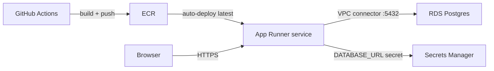

# Deploying to AWS (App Runner + RDS Postgres)

This deploys the single backtester container to **AWS App Runner** (managed
HTTPS + autoscaling) backed by **RDS for PostgreSQL**, with the image stored in
**ECR**. Infrastructure is Terraform ([terraform/](terraform)); image build +
deploy is GitHub Actions ([../.github/workflows/deploy.yml](../.github/workflows/deploy.yml)).



The app reads `DATABASE_URL` (injected from Secrets Manager) and runs
`alembic upgrade head` on start via [backend/entrypoint.sh](../backend/entrypoint.sh).
RDS is plain Postgres, so the schema is created as regular tables (no Timescale
hypertables - that's the expected RDS trade-off).

## Prerequisites
- Terraform >= 1.5, AWS CLI, and Docker.
- AWS credentials with permission to create ECR/RDS/App Runner/IAM/Secrets.

## One-time setup

### 1. Bootstrap the registry, then apply the rest
App Runner needs an image to exist before the service can start, so create the
ECR repo first, push an image, then apply everything else.

```bash
cd deploy/terraform
cp terraform.tfvars.example terraform.tfvars   # set db_password etc.
terraform init

# a) create just the registry
terraform apply -target=aws_ecr_repository.app

# b) build + push the first image to the new repo
ECR_URL=$(terraform output -raw ecr_repository_url)
aws ecr get-login-password --region "$(terraform output -raw aws_region 2>/dev/null || echo us-east-1)" \
  | docker login --username AWS --password-stdin "${ECR_URL%/*}"
docker build -t "$ECR_URL:latest" ../..
docker push "$ECR_URL:latest"

# c) create RDS + App Runner + the rest
terraform apply
```

When it finishes:

```bash
terraform output app_url   # public HTTPS URL
```

### 2. Wire up CI (GitHub Actions OIDC)
Create an IAM role that trusts GitHub's OIDC provider and can push to ECR +
call App Runner (e.g. attach `AmazonEC2ContainerRegistryPowerUser` and an
inline policy allowing `apprunner:StartDeployment`). Then in the GitHub repo set:

- Variables: `AWS_REGION`, `ECR_REPOSITORY` (= the `project` name, default
  `catalyst-backtester`), `APPRUNNER_SERVICE_ARN` (= `terraform output apprunner_service_arn`).
- Secret: `AWS_DEPLOY_ROLE_ARN` (the role above).

After that, every push to `main` builds the image, pushes `:latest` + `:<sha>`
to ECR, and App Runner auto-deploys it.

## Day-2 notes
- **Migrations** run automatically on each deploy (entrypoint -> `alembic upgrade head`).
- **Backfill** a symbol against the live DB from any machine with network access:
  ```bash
  export DATABASE_URL="postgresql://catalyst:...@<rds-endpoint>:5432/catalyst"
  cd backend && python -m app.data.backfill --source binance --symbol ETH \
    --interval 1h --start 2024-01-01 --end 2025-01-01
  ```
- **Teardown:** `terraform destroy` (RDS `skip_final_snapshot = true`, so the DB
  is deleted without a snapshot - change that for anything you care about).

## Hardening / production follow-ups
- Use a dedicated VPC with private subnets instead of the default VPC.
- Enable RDS Multi-AZ, deletion protection, and a final snapshot.
- Rotate the DB credential via Secrets Manager rotation.
- Want Timescale hypertables (compression/retention/continuous aggregates)?
  Point `DATABASE_URL` at Timescale Cloud instead of RDS - no code change; the
  migration auto-creates hypertables when the extension is present.
