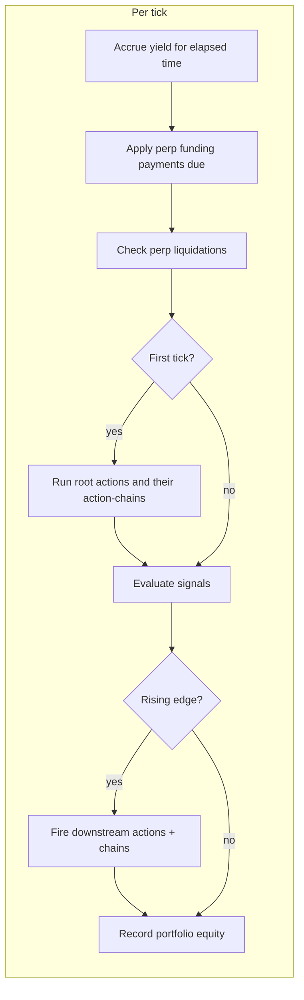
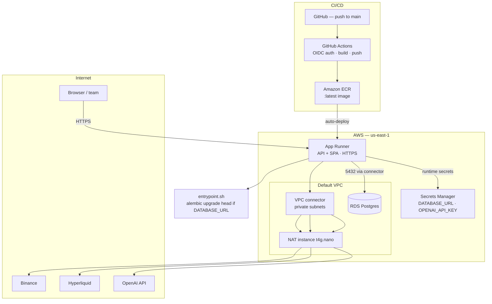
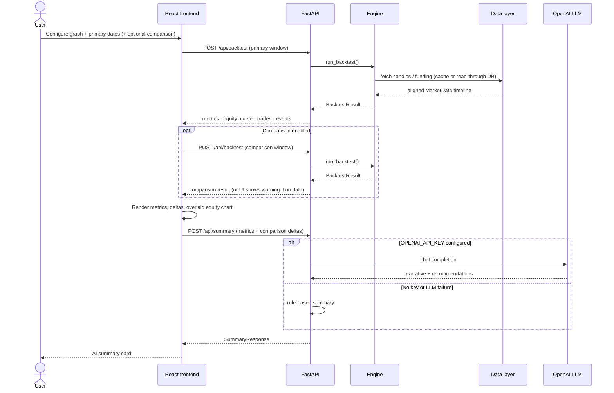
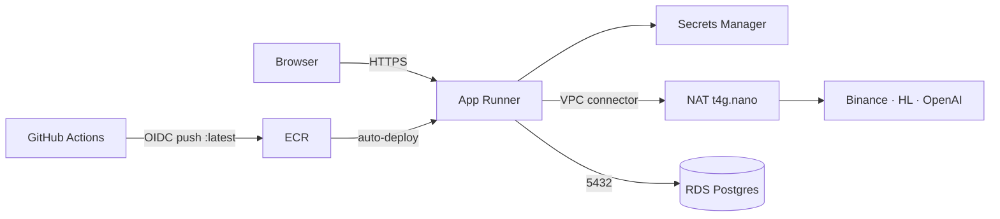

# Catalyst Backtesting Engine — Engineering Design Doc

Status: Implemented (MVP)
Owner: Backtesting
Last updated: 2026-06-05

---

## 1. Summary

The Catalyst pipeline emits trading strategies as **graphs** (nodes = actions/signals,
edges = control flow). This service accepts such a graph plus a time window and
**replays it tick-by-tick against real historical market data**, then returns how the
strategy would have performed: an equity curve, per-trade log, lifecycle events, and
summary metrics (return, drawdown, Sharpe, fees). Runs can be compared against a second
period (previous period / year-over-year / custom), and an LLM produces a plain-English
summary + recommendations (with a deterministic fallback).

It is delivered as a web app: a Python/FastAPI backend (the engine) and a React/TypeScript
frontend (input + reporting), deployed as a single Docker image.

- Live app: a single-origin site (FastAPI serves the built React app at `/`, API at `/api/*`).
- Architecture diagrams: [§5 System architecture](#5-system-architecture) (end-to-end, AWS, request flow).
- Code: [backend/](../backend), [frontend/](../frontend).

---

## 2. Goals and non-goals

### Goals
- Accept any runnable Catalyst graph and backtest it over a user-chosen period.
- Support the required action set:
  - Swaps: EVM spot (e.g. USDC→ETH on Base) and Hyperliquid spot.
  - Perps: open/close at leverage on Hyperliquid, with funding and liquidation.
  - Yield: deposit/withdraw (Aave-style) accruing interest over time.
  - Signals: `price_threshold` conditions that gate actions.
- Use **free, public data** (no paid providers, no API keys).
- Present results understandably (chart + metrics + trade log + events).
- Be deterministic and reproducible for a given input (caching).

### Non-goals (explicitly out of scope for MVP)
- Options, prediction markets, exotic instruments.
- Order-book / latency / partial-fill microstructure simulation.
- Multi-user accounts, auth, persistence of past runs.
- Live trading or real fund movement.
- Protocol-accurate yield curves (we use a flat configurable APY).

---

## 3. Key design decisions (and the open questions they answer)

| Question | Decision |
| --- | --- |
| How is granularity set? | User picks an interval (`15m`/`1h`/`4h`/`1d`). **One candle = one tick.** |
| How to fetch data? | Free public APIs (Binance mirror for EVM spot; Hyperliquid for HL candles + funding; Yahoo/Alpha Vantage for equities). Cached to parquet by default; an opt-in TimescaleDB read-through store (`DATABASE_URL`) fetches only missing gaps on demand. No pre-warm required, though an opt-in scheduled pre-warm (`PREWARM_ENABLED`) can keep a watchlist warm. |
| How is the engine called? | `POST /api/backtest` with `{graph, start, end, interval, initial_capital}` → `{metrics, equity_curve, trades, events}`. |
| Gas / tx time? | Flat, configurable cost model (gas per EVM tx, fee bps, slippage bps). Fills at candle close, no latency. |
| Failed transactions? | Balance/margin checked; insufficient funds → action skipped + `warning` event (never silent, never negative). Perps can be liquidated. |
| Tick rate / repeated firing? | Signals fire on a **rising edge** (false→true) and **re-arm** when false again — so a rung fires once per threshold crossing, not every tick. |
| Initial portfolio? | Configurable, default **$10,000 USDC**. |

---

## 4. Graph semantics

The graph is a directed structure. We classify and execute it as follows:

- **Action node with no incoming edge** → runs **once at t0** (the strategy's starting position).
  Example: `build-initial-eth-inventory`.
- **Signal node** (`price_threshold`) → a boolean predicate over the current price,
  evaluated every tick. Config: `{symbol, operator (<,>), threshold}`.
- **Edge `signal → action`** → fires the action on a **rising edge**, then re-arms when the
  signal goes back to false. This produces the repeating "ladder / round-trip" behavior.
- **Edge `action → action`** → the downstream action runs immediately after the upstream
  one (a sequential chain, fired once per upstream firing).
- `"enabled": false` nodes are skipped.



Built in [backend/app/engine/graph.py](../backend/app/engine/graph.py) (structure) and
[signals.py](../backend/app/engine/signals.py) (rising-edge state).

---

## 5. System architecture

### End-to-end architecture

Single Docker image: FastAPI serves the built React SPA at `/` and the JSON API at `/api/*`.
The frontend may orchestrate **two backtest runs** (primary + comparison window) and then call
the summary endpoint with both sets of metrics.

```mermaid
flowchart TB
  subgraph client [Client]
    browser[Browser]
  end

  subgraph fe [Frontend — React + Vite + TypeScript]
    form["Inputs panel<br/>graph JSON · dates · comparison · run"]
    dash["Results dashboard<br/>metrics · chart · trades · events · AI summary"]
  end

  subgraph api [API layer — FastAPI]
    backtest["POST /api/backtest"]
    summary["POST /api/summary"]
    examples["GET /api/examples"]
    static["Static SPA + /api/health"]
  end

  subgraph engine [Backtest engine]
    graph[graph.py<br/>parse · validate · triggers]
    sim[simulator.py<br/>tick loop]
    sig[signals.py]
    exe[execution.py<br/>swap · perp · yield]
    pf[portfolio.py]
    met[metrics.py]
  end

  subgraph ai [AI summary]
    sum[summary.py<br/>LLM or rule-based fallback]
  end

  subgraph data [Data layer]
    prov[providers.py<br/>Binance + Hyperliquid]
    repo[repository.py<br/>read-through gap-fill]
    prewarm[prewarm.py<br/>scheduled watchlist<br/>opt-in]
    cache[(Parquet cache<br/>default / HF demo)]
    db[(Postgres / TimescaleDB<br/>opt-in via DATABASE_URL)]
  end

  subgraph ext [External services]
    binance[Binance klines mirror]
    hl[Hyperliquid info API]
    llm[OpenAI-compatible LLM<br/>optional]
  end

  browser --> form
  browser --> dash
  form --> backtest
  dash --> summary
  form --> examples
  browser --> static

  backtest --> graph --> sim
  sim --> sig --> exe --> pf --> met --> backtest
  sim --> prov

  prov -->|no DATABASE_URL| cache
  prov -->|DATABASE_URL set| repo --> db
  repo -->|fetch missing gaps| binance
  repo -->|fetch missing gaps| hl
  prov --> binance
  prov --> hl
  prewarm -->|PREWARM_ENABLED, timer| repo

  summary --> sum
  sum -->|OPENAI_API_KEY set| llm
  sum -->|unset or LLM error| dash
  met --> dash
  backtest --> dash
```

### AWS deployment architecture (production)

Live URL: `https://qkz2sj2ca6.us-east-1.awsapprunner.com` · one-pager: `/overview.html`



**Networking note:** App Runner's VPC connector routes **all** egress through the VPC, so a
NAT instance is required for outbound market-data and LLM calls while still reaching private RDS.

See [§11 Deployment](#11-deployment) for hosting targets (HF Spaces vs AWS), Terraform paths,
and deploy gotchas encountered in production.

### Backtest request flow



### Module responsibilities

| Module | Responsibility |
| --- | --- |
| [models.py](../backend/app/models.py) | Pydantic schemas: `Graph/Node/Edge`, `BacktestRequest`, `CostModel`, `BacktestResult` (`Metrics`, `EquityPoint`, `Trade`, `Event`), `SummaryRequest`/`SummaryResponse`. |
| [summary.py](../backend/app/summary.py) | AI summary: LLM (OpenAI-compatible Chat Completions via httpx) with a deterministic rule-based fallback when no key is set or the call fails. |
| [data/providers.py](../backend/app/data/providers.py) | `BinanceProvider`, `HyperliquidProvider`, and `MarketData` (unified, tick-aligned prices + funding). |
| [data/cache.py](../backend/app/data/cache.py) | Parquet cache keyed by provider/symbol/interval/range (fallback when no DB). |
| [data/db.py](../backend/app/data/db.py) | SQLAlchemy engine + `is_enabled()` from `DATABASE_URL` (persistence is opt-in). |
| [data/store.py](../backend/app/data/store.py) | `candles`/`funding`/`coverage` tables + upsert/get/coverage CRUD. |
| [data/repository.py](../backend/app/data/repository.py) | Read-through cache: gap math, staleness horizon, provider gap-fill. |
| [data/backfill.py](../backend/app/data/backfill.py) | CLI to pre-warm symbols/intervals into the store. |
| [data/prewarm.py](../backend/app/data/prewarm.py) | Opt-in scheduled watchlist pre-warm (`PREWARM_ENABLED`), reusing the read-through gap-fill. |
| [engine/graph.py](../backend/app/engine/graph.py) | Parse/validate graph; compute root actions, signal/action children, and data requirements. |
| [engine/signals.py](../backend/app/engine/signals.py) | `price_threshold` evaluation + rising-edge tracking. |
| [engine/portfolio.py](../backend/app/engine/portfolio.py) | Spot balances, `PerpPosition`, `YieldPosition`; USD valuation; yield accrual. |
| [engine/execution.py](../backend/app/engine/execution.py) | Executors for swap/perp/yield; funding + liquidation helpers. |
| [engine/simulator.py](../backend/app/engine/simulator.py) | The tick loop orchestrating the above. |
| [engine/metrics.py](../backend/app/engine/metrics.py) | Return, max drawdown, annualized + clamped Sharpe, win rate, fees. |
| [api/routes.py](../backend/app/api/routes.py) + [main.py](../backend/app/main.py) | HTTP endpoints + static frontend serving. |

---

## 6. Data model (request/response)

Request:

```jsonc
{
  "graph": { "nodes": [...], "edges": [...] },
  "start": "2026-02-04",
  "end":   "2026-06-04",
  "interval": "1h",
  "initial_capital": 10000,
  "costs": { /* optional CostModel overrides */ }
}
```

Response: `Metrics` + `equity_curve: EquityPoint[]` + `trades: Trade[]` + `events: Event[]`.
A `Trade` records `{t, node_id, kind, chain, symbol, side, qty, price, usd_value, fee_usd, realized_pnl, note}`.
An `Event` is `{t, level (info|warning|error), node_id?, message}`.

---

## 7. Data layer

### Sources
- **EVM spot pricing** (e.g. `chain: base`) → Binance `GET /api/v3/klines` (OHLCV), paginated 1000/req.
  - The primary `api.binance.com` geo-blocks some regions (HTTP 451), so the provider
    probes and falls back across `data-api.binance.vision` → `api.binance.us` → `api.binance.com`.
- **Hyperliquid spot/perp pricing** → `POST /info` `candleSnapshot` (OHLCV). Note: only the
  **most recent ~5000 candles** are available per market.
- **Perp funding** → `POST /info` `fundingHistory` (8h cadence).
- **US equities** (`chain: equity`) → Yahoo Finance chart API (free, no key). Optional
  **Alpha Vantage** fallback when `ALPHA_VANTAGE_API_KEY` is set (free tier: 25 req/day).
  Stored in the persistence layer under source `yahoo`.
- USDC/USDT/DAI are pegged to **$1**.

### Unified timeline (`MarketData`)
1. The engine computes data requirements from the graph: `(symbol, venue)` price series and
   the set of perp symbols needing funding.
2. Each required series is fetched and reindexed onto a single **master timeline** (union of
   candle open times within `[start, end]`), forward/back-filled.
3. Funding events are collected as `(timestamp, symbol, rate)` and applied at the first tick
   on/after each event time.
4. **Fallbacks for robustness:**
   - If an HL-specific series is missing for the range, `price()` falls back to the EVM
     (Binance) price as a proxy (and funding is simply skipped).
   - If a strategy has **no** price/signal nodes (e.g. yield-only), the timeline is
     **synthesized** from the date range so the run still proceeds.

### Caching / persistence
Two backends, selected at runtime by `DATABASE_URL`:

- **Parquet fallback (default, zero-ops).** Fetched frames are written under
  `backend/.cache/`, keyed by provider/symbol/interval/range. Re-runs over the *same*
  window are offline and reproducible. This keeps the public HF demo dependency-free.
- **TimescaleDB persistence layer (opt-in).** When `DATABASE_URL` is set, providers route
  through a **read-through repository** ([repository.py](../backend/app/data/repository.py))
  over a real time-series store ([store.py](../backend/app/data/store.py)). This is the
  deliberate post-MVP data layer; the trade-off it buys (and its operational cost) is below.

#### Schema (Alembic migration `0001_initial`)
- `candles(source, symbol, interval, ts, open, high, low, close, volume)`, PK
  `(source, symbol, interval, ts)` — a Timescale **hypertable** on `ts` when the extension
  is present (degrades to a plain table on vanilla Postgres).
- `funding(source, symbol, ts, rate)`, PK `(source, symbol, ts)` — hypertable on `ts`.
- `coverage(source, symbol, interval, seg_start, seg_end)` — contiguous windows already
  fetched, so we distinguish *"fetched, genuinely empty"* (real exchange gap) from
  *"never fetched"*. `source` is `binance` or `hyperliquid`.

#### Read-through + staleness algorithm
For a request window `[S, E]` of `(source, symbol, interval)`:
1. Load coverage segments; subtract them from `[S, E]` to get the **missing gaps**.
2. Define a freshness horizon `H = now − interval` (the last fully-closed candle). The live
   tail `(H, E]` is **always** treated as a gap, so recent data refreshes every run.
3. Fetch only the gaps from the provider, `upsert` the rows, then record coverage up to
   `min(gap_end, H)` — the live tail is never marked covered.
4. Read `[S, E]` back from the store and hand the same OHLCV frame shape to `MarketData`.

The set arithmetic (`merge_segments`, `subtract_coverage`, `compute_gaps`) is pure and unit
tested without a database. Net effect: each candle is fetched from the exchange **once** and
reused across any overlapping date range, instead of re-keying a whole parquet blob per range.

#### Ingestion
There is **no required pre-warm step** — read-through fetches whatever is missing the
first time it is requested. Pre-warming is purely a latency optimization with two entry points,
both of which reuse the *same* gap-fill path (and so are idempotent):
- **Read-through (on demand):** the path above runs transparently during a backtest.
- **Manual backfill:** [backfill.py](../backend/app/data/backfill.py)
  (`python -m app.data.backfill --source binance --symbol ETH --interval 1h --start ... --end ...`,
  or `--funding` for Hyperliquid) pre-warms the store through the same gap-fill logic.
- **Scheduled pre-warm (opt-in):** [prewarm.py](../backend/app/data/prewarm.py) is an in-process
  loop (App Runner has no native cron) that warms a watchlist on boot and every
  `PREWARM_INTERVAL_HOURS`. It is gated behind `PREWARM_ENABLED=1` and a configured
  `DATABASE_URL`, and the watchlist is overridable via `PREWARM_WATCHLIST` (JSON). Because gap-fill
  is idempotent, running it across multiple instances is safe.

#### Operational cost (why it is opt-in)
The cost is exactly what an MVP avoids: a running DB service, schema/migrations
(Alembic, run on container start when `DATABASE_URL` is set), and staleness management. The
free single-container HF Space can't persistently host Timescale, so the demo keeps the
parquet fallback and production points `DATABASE_URL` at a managed Timescale.

---

## 8. Execution model

Common assumptions: fills at candle **close**; flat per-venue costs from `CostModel`
(EVM gas per tx, swap fee bps, slippage bps; HL taker fee bps, slippage bps).

### Swap / spot ([execution.py](../backend/app/engine/execution.py) `execute_swap`)
- **Buy** (`from USDC`): `amount` is **USD notional**. Tokens received =
  `(usd_in − fee − slippage) / price`; gas debited from USDC. Balance checked first. The
  USD paid is added to the asset's **cost basis**.
- **Sell** (`to USDC`): `amount` is **token quantity** (or `"all"`). USD out =
  `qty·price − fee − slippage − gas`. **Realized PnL** = proceeds − proportional cost basis,
  so spot strategies contribute to the win rate.
- Insufficient balance → skip + `warning`. (`amount` greater than holdings is **not** a
  partial fill in the strict model; it is skipped.)

### Perps ([execution.py](../backend/app/engine/execution.py) `execute_perp`)
- **Open/add**: `margin = size_usd / leverage` debited from USDC (plus taker fee).
  Position holds signed `size_tokens`, weighted-average `entry_price`, aggregate `margin`.
- **Close** (`reduce_only: true`): closes up to the position size; realized PnL =
  `sign · close_tokens · (price − entry)`; releases proportional margin back to USDC.
- **Funding** (`apply_funding`): every 8h, `payment = sign · rate · notional` charged to the
  position margin (longs pay shorts when rate > 0).
- **Liquidation** (`check_liquidations`): each tick, if
  `position_equity ≤ maintenance_frac · notional`, the position is closed and the margin is
  wiped, logged as a `warning` **and recorded as a synthetic `perp_close` trade** (with the
  realized loss) so the trade log and PnL reconcile.

### Yield ([execution.py](../backend/app/engine/execution.py) `execute_yield`)
- **Deposit**: moves USDC into a `YieldPosition` (principal), debits EVM gas.
- **Withdraw**: returns principal (incl. accrued) up to `amount` (or `"all"`).
- **Accrual** ([portfolio.py](../backend/app/engine/portfolio.py) `accrue_yield`): each tick,
  `principal *= (1 + apy · dt / year)` using the elapsed time between ticks.

### Valuation
Total equity each tick = spot balances (× price, stables = $1) + perp equity
(`margin + unrealized_pnl`) + yield principal.

---

## 9. Metrics

Computed in [metrics.py](../backend/app/engine/metrics.py) from the equity curve + trades:

- **Total return %** = `final/initial − 1`.
- **Max drawdown %** = worst peak-to-trough on the equity curve.
- **Sharpe** = annualized mean/stdev of per-tick returns, **clamped to ±100** (near-deterministic
  equity, e.g. yield-only, otherwise yields absurd ratios).
- **Win rate** = fraction of closing trades (non-zero realized PnL) that are profitable.
- **Trades**, **total fees**.

---

## 10. API and frontend

### API ([api/routes.py](../backend/app/api/routes.py))
- `POST /api/backtest` → run a backtest (synchronous; runs complete in seconds).
- `POST /api/summary` → LLM narrative + recommendations from metrics (and optional
  comparison deltas); always returns 200 with a rule-based fallback if the LLM is
  unavailable.
- `GET /api/examples` → the 15 bundled example strategies.
- `GET /api/health`.
- Errors map to HTTP codes: bad graph/params → 400, upstream data issue → 502, else 500.

### Frontend ([frontend/src](../frontend/src))
- Graph JSON editor with live validation, example loader, and a config form
  (date range, granularity, initial capital). All dates/times are UTC.
- **Period-over-period comparison:** a second window (previous period / year-over-year /
  custom) is backtested alongside the primary; the frontend orchestrates both runs and
  degrades gracefully (keeps the primary result + warns) if the comparison range has no data.
- Results dashboard: an AI summary card, metric cards with good/bad-aware deltas vs the
  comparison period and per-metric tooltips, a fullscreen-able equity chart that overlays
  both periods (labeled axes), an events list, and a trade log. The inputs panel collapses
  to give results the full width.
- Calls the API at the relative path `/api`, so it works same-origin in prod and via the
  Vite dev proxy locally.

---

## 11. Deployment

Single Docker image ([Dockerfile](../Dockerfile)):
1. Stage 1 (`node:20-alpine`) builds the React app.
2. Stage 2 (`python:3.12-slim`) installs backend deps, copies the build, and runs
   [entrypoint.sh](../backend/entrypoint.sh): if `DATABASE_URL` is set it runs
   `alembic upgrade head` first, then launches `uvicorn` serving both the API and the static
   SPA on port `7860`. With no `DATABASE_URL`, migrations are skipped (parquet fallback).

### Hosting targets
The same image runs two ways:

- **Hugging Face Spaces** (zero-ops demo): Docker SDK, no `DATABASE_URL`, so it uses the
  parquet fallback. Free, sleeps on inactivity.
- **AWS (production)**: App Runner + RDS Postgres, provisioned by Terraform in
  [deploy/](../deploy). This is the live deployment.

### AWS topology ([deploy/terraform](../deploy/terraform))

See **[§5 AWS deployment architecture](#aws-deployment-architecture-production)** for the full diagram.
A condensed view:



Key points:
- App Runner uses a **VPC connector** to reach private RDS; since that routes all egress
  through the VPC, a small **NAT instance** gives the connector internet access for
  market-data fetches (≈10x cheaper than a managed NAT Gateway).
- `DATABASE_URL` is injected from **Secrets Manager**; [entrypoint.sh](../backend/entrypoint.sh)
  runs `alembic upgrade head` on start.
- `OPENAI_API_KEY` is an **optional** Secrets Manager secret (created by Terraform only when
  `TF_VAR_openai_api_key` is supplied) for AI summaries; `OPENAI_MODEL`/`OPENAI_BASE_URL` are
  plain runtime env. With no key, the app uses the rule-based summary fallback.
- `ALPHA_VANTAGE_API_KEY` is an **optional** Secrets Manager secret (`TF_VAR_alpha_vantage_api_key`)
  for US equity fallback data when Yahoo Finance returns empty.
- RDS is **plain Postgres** (no Timescale extension on RDS); the schema degrades to regular
  tables. Point `DATABASE_URL` at Timescale Cloud to get hypertables, no code change.
- **CI/CD** ([.github/workflows/deploy.yml](../.github/workflows/deploy.yml)): push to `main`
  → GitHub OIDC (no static keys) → build/push to ECR → App Runner auto-deploys.

### Deploy gotchas worth knowing (encountered and solved)
- New AWS accounts default to the **Free Plan**, which blocks App Runner + restricts RDS;
  the account must be upgraded to a paid plan.
- App Runner is **not available in every AZ** (e.g. `use1-az3` in us-east-1); unsupported
  AZs are excluded from the connector subnets.
- App Runner with a VPC connector has **no internet** without a NAT in the connector's
  subnets (the cause of market-data timeouts until the NAT instance was added).

For local dev with persistence, [docker-compose.yml](../docker-compose.yml) brings up
Postgres + the app wired via `DATABASE_URL`.

---

## 12. Testing

[backend/tests](../backend/tests):
- `test_graph.py` — parsing, trigger structure (roots, chains, signal children), validation errors.
- `test_execution.py` — swap buy/sell math, perp open/close PnL, yield deposit/withdraw,
  insufficient-balance warnings.
- `test_examples.py` — runs **all 15 example graphs** against deterministic synthetic data
  (offline), asserting equity is finite/non-negative and metrics are self-consistent.
- `test_data.py` — yield-only timeline synthesis (no network).
- `test_persistence.py` — pure gap/coverage/staleness arithmetic (always), plus a
  read-through round-trip integration test gated on `DATABASE_URL` (skipped offline).
- `test_summary.py` — rule-based summary fallback: number formatting, comparison-trend
  wording (increased/decreased), and high-drawdown recommendation flags (no network).
- `synthetic.py` — a sine-wave ETH price path that crosses every example threshold.

---

## 13. Limitations and future work

- **Data fidelity**: HL candle history is limited to ~5000 recent candles; deep-history perp
  runs fall back to Binance proxy pricing with funding skipped. Yield uses a flat APY rather
  than live historical protocol rates.
- **Execution realism**: fills at close (same-candle, mild look-ahead), flat slippage/fees,
  no order-book depth, no latency, no MEV/priority fees. Spot orders with insufficient
  balance are skipped (no partial fill); perp closes snap sub-$1 dust and support `"all"`.
- **Single-asset focus**: examples are ETH; the engine generalizes to other symbols but is
  untested beyond ETH/USDC.
- **No run persistence/auth**: backtest runs themselves are stateless and synchronous (the
  Timescale layer persists *market data*, not run results).

Possible next steps: a job queue for long/large runs; protocol-accurate yield and funding;
richer signals (indicators, time-based, cross-asset); position-sizing as % of equity;
saved/shareable backtests; Timescale continuous aggregates/retention policies for the store;
and parameter sweeps.
